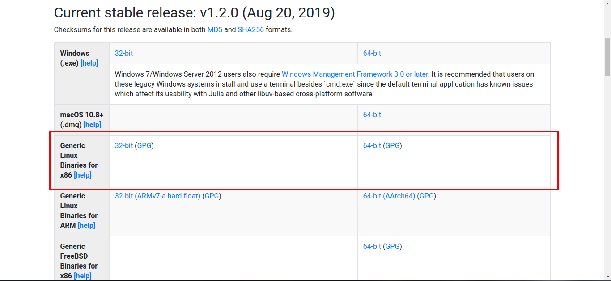
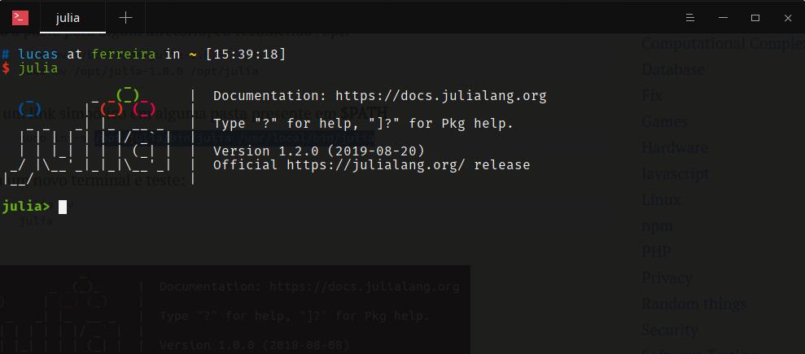

E aí, turma! Tudo bem?

Dessa vez eu venho aqui rapidamente para mostrar para vocês como instalar a linguagem [Julia](https://julialang.org) na sua distro Linux.

Atualmente eu estou utilizando o [Manjaro](http://manjaro.org/) na versão 18. 

Algumas distribuições já trazem o pacote da linguagem nos seus repositórios, mas aqui vamos aprender a instalar usando os binários do Julia. Então vamos aos finalmentes.

1 - Baixe o pacote em https://julialang.org/downloads



2 - Depois do download, entre via terminal na pasta onde o arquivo foi salvo 

```cd Downloads```

e exatraia o pacote:

```tar -vzxf julia-1.2.0-linux-x86_64.tar.gz```

3 - Em seguida, mova o diretório para alguma pasta de sua preferência. Eu prefiro a pasta ```/opt```:

```sudo mv julia-1.2.0 /opt```

4 - E, por fim, crie um link simbólico da seguinte maneira:

```sudo ln -s /opt/julia-1.2.0/bin/julia /usr/local/bin/julia```

Depois de seguir estes passos, verifique se o interpretador do Julia já está funcionando. Caso não funcione de primeira, abra um novo terminal ou reinicie a sessão.

```julia -v
julia```

Após executar ```julia``` seu terminal deve ficar assim:



Simples demais, né? Espero que você se divirta aprendendo Julia e logo mais espero escrever um pouco mais sobre Julia. Abraço!
